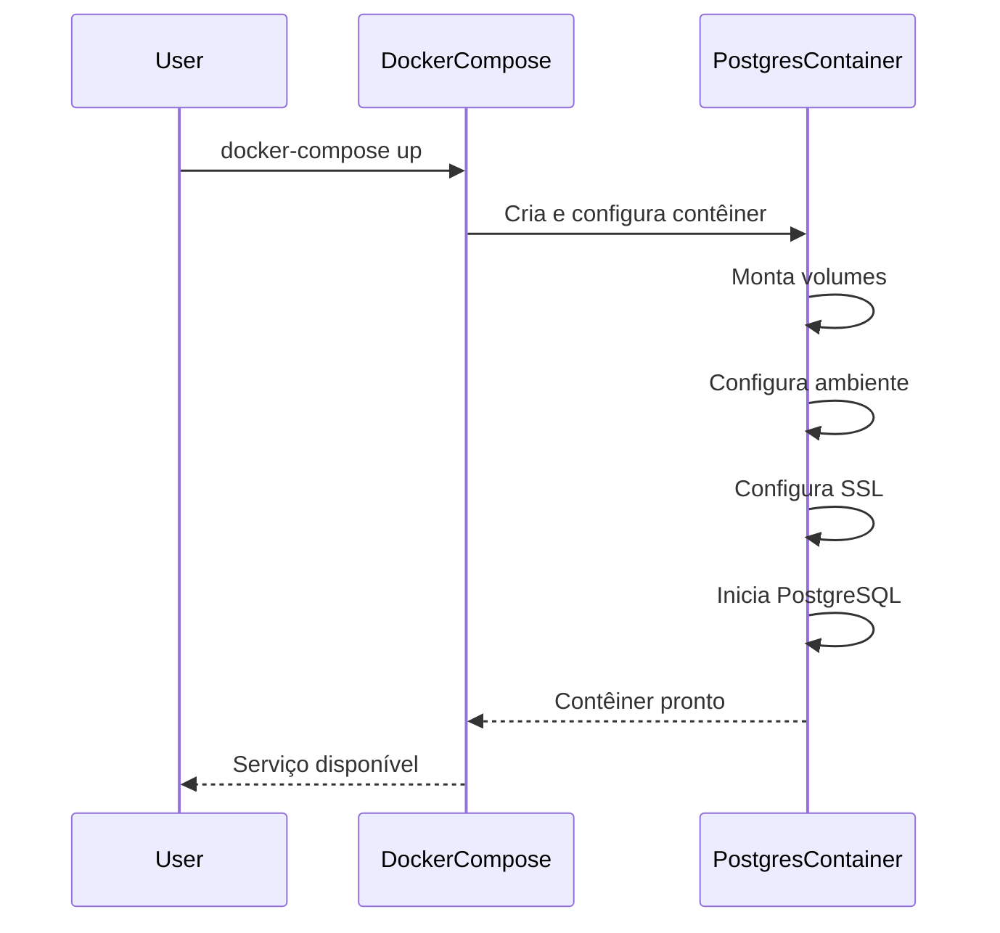

# Containner PostgreSQL

```mermaid
sequenceDiagram
    participant User
    participant DockerCompose
    participant PostgresContainer
    
    User->>DockerCompose: docker-compose up
    DockerCompose->>PostgresContainer: Cria e configura contêiner
    PostgresContainer->>PostgresContainer: Monta volumes
    PostgresContainer->>PostgresContainer: Configura ambiente
    PostgresContainer->>PostgresContainer: Configura SSL
    PostgresContainer->>PostgresContainer: Inicia PostgreSQL
    PostgresContainer-->>DockerCompose: Contêiner pronto
    DockerCompose-->>User: Serviço disponível
```